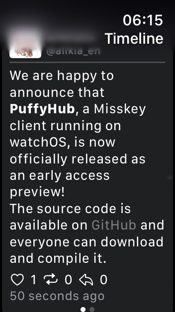
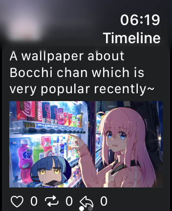
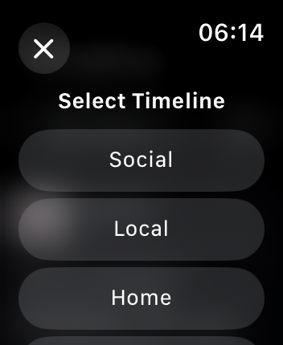

# PuffyHub

PuffyHub is a [Misskey](https://misskey-hub.net) client for [watchOS](https://www.apple.com/watchos/).

## 👀 Previews

## 🌟 Functions & To-dos

- [x] Log in to a instance running Misskey 13+ via [MiAuth](https://misskey-hub.net/ja/docs/for-developers/api/token/miauth/)
- [x] Basic timeline view, with image(include WebP) support
- [x] Basic markdown syntax for note view
- [x] Switch timeline between home, local, hybrid and global
- [x] Support viewing renote
- [x] Open link in browser on your watch
- [x] Custom emoji support in note view
- [x] Sending note
- [x] Reply
- [x] Like reaction
- [x] Note detaile page
- [ ] Support CW(NSFW) in timeline
- [ ] Renote
- [ ] Renote (quote)
- [ ] Personal profile page

## 🔧 For Developers

You can check out our [documentation](./Docs/README.md) for more details.

## 🥰 Thanks

Thanks to all of my friends who helped me during developing, and **special thanks to [@Lakr233](https://twitter.com/@Lakr233)**.

Made with ❤️ by [alikia2x](https://alikia2x.com).
